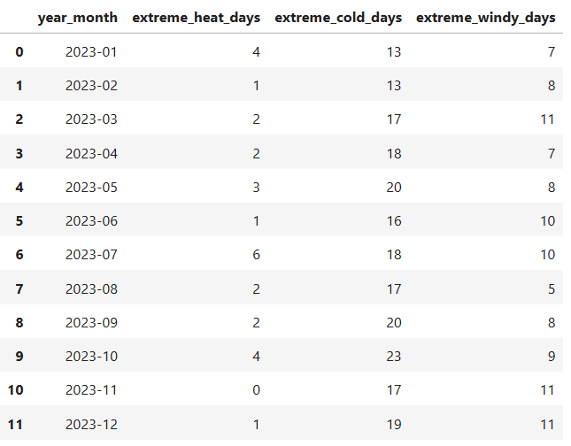
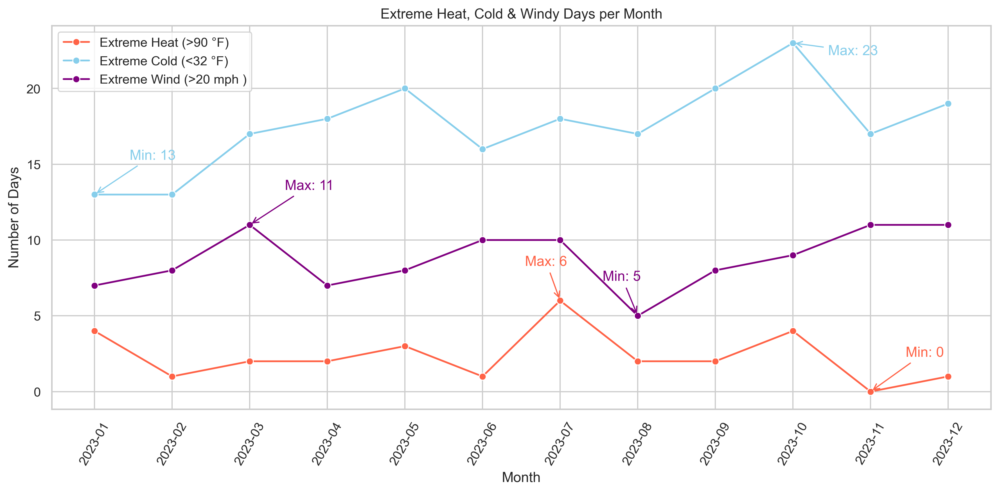

# Weather Data Analysis (Learning Project)

---

🇮🇩 **Bahasa Indonesia**
### Ringkasan Proyek   
Proyek eksplorasi data cuaca untuk mengembangkan kemampuan **data analytics**, melatih penggunaan **SQL**, dan membuat **visualisasi data dengan Python**.  
Project ini dibuat sebagai latihan tambahan dan portfolio.

🇬🇧 **English Version**
### Project Overview   
A weather data exploration project to strengthen **data analytics skills**, practice **SQL queries**, and build **data visualization using Python**.  
This project was created as an additional practice and part of a portfolio.

---

## 📌 Fitur Utama / Key Features
- 🔍 SQL Query Practice (SELECT, GROUP BY, filtering, aggregation)  
- 📊 Data Visualization with Python (matplotlib & seaborn)  
- 🌦️ Weather trend analysis (temperature, wind speed, extreme weather days)  

---

## 📖 Contoh SQL Query / Example SQL Query
```sql
SELECT
    strftime('%Y-%m', date) AS year_month,
    COUNT(CASE WHEN tmax_f > 90 THEN 1 END) AS extreme_heat_days,
    COUNT(CASE WHEN tmin_f < 32 THEN 1 END) AS extreme_cold_days,
    COUNT(CASE WHEN wspd_mph > 20 THEN 1 END) AS extreme_windy_days
FROM daily_weather
GROUP BY year_month
ORDER BY year_month;
```
  🖼️ Output:  
   
---

🖼️ **Preview (Extreme Heat, Cold & Windy Days)**  
  

---

🇮🇩 **Bahasa Indonesia**  
📊 **Insight Interpretasi Chart**  
Visualisasi ini menunjukkan:  
1. **Hari dingin ekstrem** (<32 °F) lebih sering terjadi dibanding hari panas ekstrem (>90 °F) dan hari berangin ekstrem (>20 mph).  
2. Jumlah **hari dingin ekstrem** meningkat tajam di akhir tahun (Oktober–Desember), dengan puncak pada November.  
3. **Hari panas ekstrem** hanya muncul di musim panas (Juli–Agustus) dengan jumlah yang relatif sedikit (≤ 6 hari/bulan).  
4. **Hari berangin ekstrem** banyak terjadi pada awal musim semi (Maret) dan musim dingin (Desember).  
5. Pola ini menggambarkan wilayah dengan **iklim empat musim**, dengan musim dingin yang lebih ekstrem dibandingkan musim panas.  

### 💡 Potensi Pemanfaatan Data Lanjutan  
- **⚡ Perencanaan Energi**: Prediksi permintaan listrik untuk pemanas & pendingin udara.  
- **🛍️ Industri Ritel**: Atur stok produk musiman (jaket, kipas angin) sesuai pola cuaca ekstrem.  
- **🚨 Peringatan Dini**: Bahan untuk warning cuaca berangin ekstrem.  
- **🏗️ Perencanaan Infrastruktur**: Pertimbangan konstruksi & jaringan listrik.  
- **🎪 Aktivitas Luar Ruangan**: Panduan event, olahraga, atau pariwisata.  

🇬🇧 **English Version**  
📊 **Chart Interpretation Insight**  
This visualization shows:  
1. **Extreme cold days** (<32 °F) occur more frequently than extreme hot days (>90 °F) and extreme windy days (>20 mph).
2. The number of **extreme cold days** increases sharply at the end of the year (October–December), peaking in November.
3. **Extreme hot days** only occur in summer (July–August) with relatively few occurrences (≤ 6 days/month).
4. **Extreme windy days** occur frequently in early spring (March) and winter (December).
5. This pattern describes a region with **a four-season climate**, with winters being more extreme than summers.

### 💡 Potential for Further Data Utilization  
- **⚡ Energy Planning**: Predict electricity demand for heating & air conditioning.
- **🛍️ Retail Industry**: Adjust seasonal product inventory (jackets, fans) according to extreme weather patterns.
- **🚨 Early Warning**: Material for extreme wind weather warnings.
- **🏗️ Infrastructure Planning**: Considerations for construction and electrical networks.
- **🎪 Outdoor Activities**: Guidelines for events, sports, or tourism.

---

### Dataset  
- **Source:** [LinkedIn Post by Mary Koneferl](https://www.linkedin.com/posts/mary-knoeferl_extreme-weather-data-analysis-project-mknoeferl-activity-7371233708634419200-gv5c?utm_source=share&utm_medium=member_desktop&rcm=ACoAAAvEfcEBGoC1T5quuEpkCHJA9lb82uz-6iw)
- **Size:** 7 columns, 370 entries.
- 📌 The database for this project can be found here: [Dataset](https://lnkd.in/gkxiUeMs)   

### Teknologi / Tech Stack
- SQL  
- Python (Jupyter Notebook, pandas, matplotlib, seaborn)

### Struktur Repositori / Repository Structure
```text
├── data/
│   └── Weather.db
├── images/
│   ├── extreme_heat_cold_windy.png
│   └── sql_output.png
├── notebooks/
│   └── Weather Analysis.ipynb
├── .gitignore
├── LICENSE
├── README.md
└── requirements.txt
```

### Kontak / Contact
📧 Email: hfzmustafa07@gmail.com  
LinkedIn: https://www.linkedin.com/in/hafiz-mustafa-harras-62914b56  

🌐 Portfolio Repository: https://github.com/hfz1988/data-analytics-portfolio-hafiz
